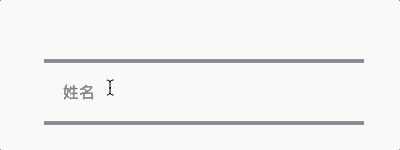
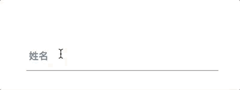
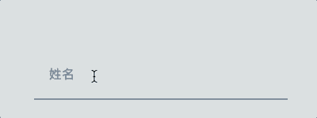
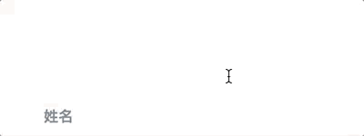
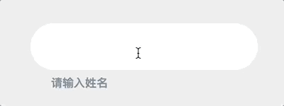
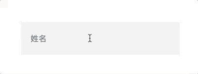

# effect-input

[![NPM version][badge-npm-version]][url-npm]
[![Node version][badge-node-version]][url-npm]
[![NPM download][badge-npm-download]][url-npm]
![Dependencies][badge-dependencies]
![License][badge-license]

优雅而绚丽的适用于 Vue 2.0 的 `input` 组件。极大提高交互效果和输入愉悦性。

[![NPM][image-npm]][url-npm]

> 深受 [TextInputEffects][url-TextInputEffects] 的启发。

<!-- **中文 | [English](./README_en.md)** -->

## 概览

[访问在线示例](https://xbt1.github.io/effect-input)

## 安装

```bash
$ yarn add effect-input # npm i -S effect-input
```

## 使用

一个简单的例子

```javascript
import EffectInput from 'effect-input'
import 'effect-input/dist/index.css'

Vue.use(EffectInput)
```

```html
<template>
  <effect-input v-model="value" type="jiro" label="姓名"></effect-input>
</template>
```

## 主题

`effect-input` 的 `type` 属性为主题名，目前有如下主题：

### `haruki`



### `hoshi`



### `kuro`


### `jiro`



### `minoru`



### `yoko`


### `hideo`


### `kyo`



### `akira`


### `ichiro`


### `juro`


### `madoka`


### `kaede`



### `isao`


## 开发

```bash
$ npm install
$ npm run dev
```

## 构建

```bash
$ npm run build:package # 构建 npm 包
$ npm run build:example # 构建示例站点
$ npm run build # build:package & build:example
```

## TODOs

- 添加更多主题
  - SET 2
    - [x] `manami`
    - [x] `nariko`
    - [ ] `nao`
    - [ ] `yoshiko`
    - [ ] `shoko`
    - [ ] `chisato`
    - [ ] `makiko`
    - [ ] `sae`
    - [ ] `kozakura`
    - [ ] `fumi`
    - [ ] `ruri`
    - [ ] `kohana`

## 更新日志

详见 [releases][url-releases]


[badge-npm-version]: https://img.shields.io/npm/v/effect-input.svg
[badge-node-version]: https://img.shields.io/node/v/effect-input.svg
[badge-npm-download]: https://img.shields.io/npm/dt/effect-input.svg
[badge-license]: https://img.shields.io/github/license/xbt1/effect-input.svg
[badge-dependencies]: https://img.shields.io/david/dev/xbt1/effect-input.svg

[url-TextInputEffects]: https://tympanus.net/Development/TextInputEffects/index.html
[url-npm]: https://npmjs.org/package/effect-input
[url-dependencies]: https://david-dm.org/vkbansal/effect-input
[url-releases]: https://github.com/XBT1/effect-input/releases

[image-npm]: https://nodei.co/npm/effect-input.png

